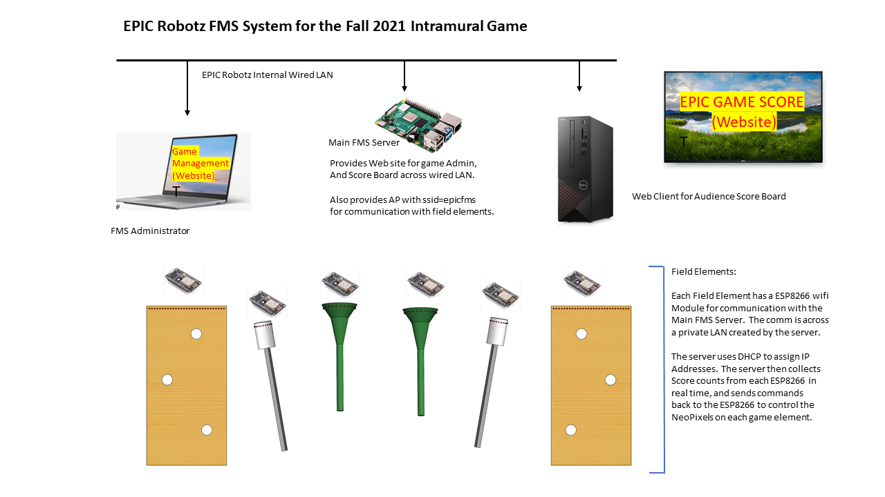

### The EPIC FMS 
**Sept 2021 EPIC Robotz**

This repository stores code that implements a field management system (FMS) for a simple game hosted by EPIC Robots. 

The game consists of robots shooting at various targets during a match. All targets have electronic sensors to detect hits.  The hits are counted at each target and then reported back to a central server, called the "EpicFMS server".  The EpicFMS server talleys the score and provides that information via MQTT and on a website that the EpicFMS hosts.  

The website that is hosted by EpciFMS server actually has two interfaces: the scoreboard and the game management interface.  The game management interface allows game administors to start, stop, reset the game.  Game parameters can also be set through the game management interface.

Finally, the EpicFMS server sends game status and commands back to the field elements -- mainly to control LEDs while the game is being played.

This repository contains all code and documentation for this system, including the code for the EpicFMS website, and the code for the electronics in the various targets. 

### Block Diagram

