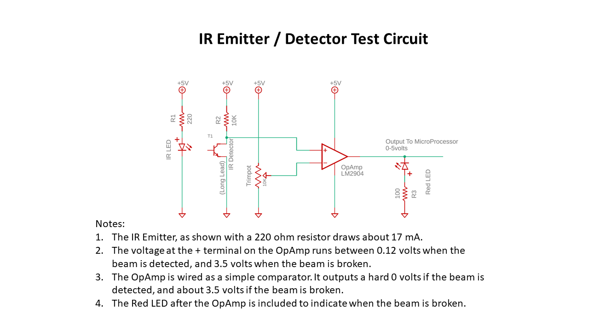
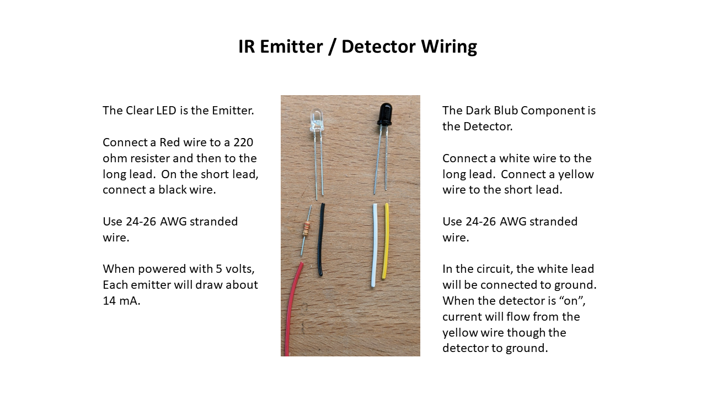
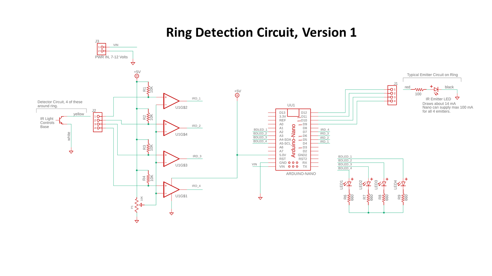
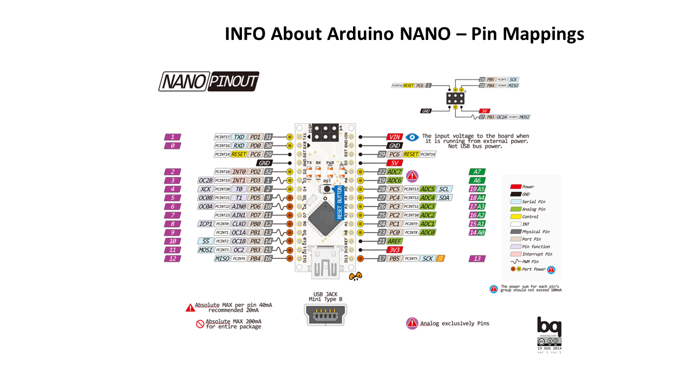

# EPIC FMS Documetation 

This folder contains notes and misc info that pertains to the EPIC FMS project.  

Some of this information is prepared in a power-point that is then 
converted to a PDF and the following PNG files:

### Wiring Diagram for Detection Test Circuit

### Wiring for IR Emitter / Detector 

### Schematic For Hit Detector for Ring -- V1

### Information Regarding Arduino Nano
